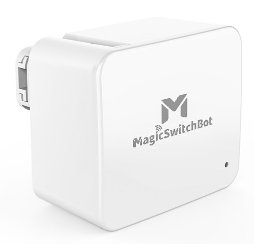
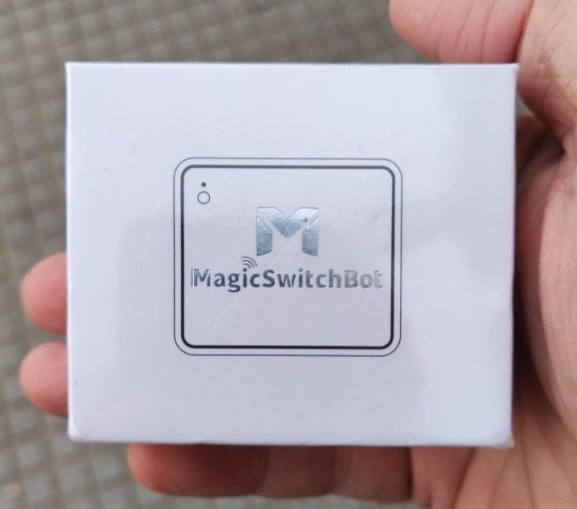
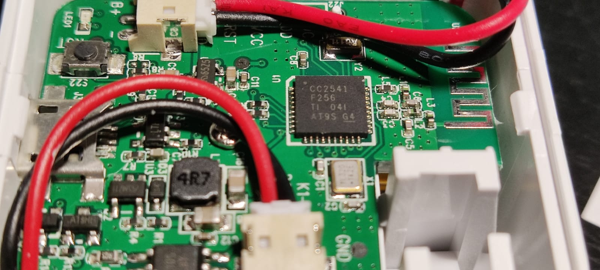

# pyMagicSwitchbot


This is a Python library that allows the integration of *Magic Switchbot* devices in open source projects like home automation.

## Product description

The [Magic Switchbot device](https://www.interear.com/smart-products/magic-bluetooth-switchbot.html) was apparently a clone of the *Switchbot* manufactured by the Chinese company *Shenzhen Interear Intelligent Technology Co., Ltd*. Nowadays, the device seems to be discontinued and cannot be bought at any place.





If we open the device (which is easy just lifting a lid), we can see it is based upon a low power and high performance [**CC2541**](https://www.ti.com/product/CC2541) SOC chip, manufactured by Texas Instruments. It is compatible with BLE (Bluetooth Low Energy) 4.0.

This is the board overview we see when opening the lid:



The device has an internal 360mAh LiPo battery that can be recharged via its MicroUSB connector and according to the manufacturer its charge can last up to 2 or 3 months.

The device has 2 different working modes:

* **Switch**.
  In this mode, you can *turn on* or *turn off* a device. For this mode to work, the manufacturer provides an extension "hook" that can be attached to the physical switch you want to activate, so that when you *turn off* it effectively *pulls* the hook. You can watch a video tutorial [in this link](https://cloud.video.alibaba.com/play/u/2153292369/p/1/e/6/t/1/d/hd/278038162598.mp4).

* **Push button**.

  In this mode, the device simply *pushes* the object to which it is attached for a second and then retracts to its original position every time you activate it.


## Device API and protocol

The device uses a *propietary* BLE protocol that I documented based on information provided by the manufacturer and some reverse engineering of the bluetooth logs and the original [Android App](https://m.apkpure.com/es/magicswitchbot/com.runChina.moLiKaiGuan/download/17-APK). Unfortunately, the app is no longer present at Google Play.

The documentation is published [here](doc/MagicSwitchBot_API.md).

## References

The latest version of this library is based on `bleak`, so theoretically it should work on Linux, Windows or Mac, although I've only tested it on Linux.

The code is strongly influenced by [pySwitchbot](https://github.com/Danielhiversen/pySwitchbot) library by [Daniel Hjelseth Høyer (Danielhiversen)](https://github.com/Danielhiversen). My original idea was to modify this library and make it work for both devices families, but the internal working mode is quite different and most of the code was going to be different, so I decided to start a new project but using some of his good techniques and code.

## Important Note

IMPORTANT: hcitool and python are not allowed to access bluetooth stack in Linux unless the user is root.
To solve it (insecure), you must run these commands if you don' t have the privileges:          

```bash
sudo apt-get install libcap2-bin
sudo setcap 'cap_net_raw,cap_net_admin+eip' $(readlink -f $(which python3))
sudo setcap 'cap_net_raw+ep' $(readlink -f $(which hcitool))
```
## Using the library

You need Python 3.10 or newer to use the library, and it is published to PyPi. So to use it just fetch it:

```bash
pip install pymagicswitchbot
```

From your program just import the library or only the main class:

```python
import magicswitchbot

--OR--

from magicswitchbot import MagicSwitchbot
```

### Constructor

The library uses a main class called `MagicSwitchbot`. The constructor gets the device's MAC address as a parameter:

`MagicSwitchbot(device, password=None, interface=0, scan_timeout=5, retry_count=3)`

##### Parameters:
* `device` : BLEDevice (Required)
  A bluetooth device discovered from the `bleak` library.
  
* `password` : string (Optional)
  Password or PIN set on the device.
  
* `interface` : int (Optional)
  Order of the bluetooth client interface to use. It will be prefixed by 'hci'. Default is 0 (hci0)
  
* `scan_timeout` : int (Optional)
  
  Max timeout when looking for devices. Default: 5 seconds
  
* `retry_count` : int (Optional)
  Number of retries if the connection does not succeed. Default: 3 times.

### Methods

In addition to the constructor, the main class has the following public methods:

* `async turn_on() ‑> bool`
  Use the device to switch something on.
  
  Returns bool: Returns True if the command was sent succesfully.
  
* `async turn_off() ‑> bool`
  Use the device to switch something off.

  Returns bool: Returns True if the command was sent succesfully.
  
* `async push() ‑> bool`
  Use the device just to push a button.

  Returns bool: Returns True if the command was sent succesfully.
  
* `async get_battery() ‑> int`

  Gets the device's battery level

  Returns int: Level of the device's battery, from 0 to 100
* `async get_basic_info() ‑> dict`

  Gets device's basic information

  Returns a dictionary with the following items regarding the device:
  
  * `battery`: level of the device's battery.
  * `firmware`: version of the device's firmware.
  * `chip_type`
  * `device_type`
  * `password_enabled`: True if the device has a PIN number set, False otherwise

## Example code

The following example shows how to use the library in your Python program:

```python
# Test program (tests/testAsync.py)
'''
Testing MagicSwitchBot devices library

IMPORTANT: hcitool and python is not allowed to access bluetooth stack unless the user is root
          To solve it (unsecure):
          
            sudo apt-get install libcap2-bin
            sudo setcap 'cap_net_raw,cap_net_admin+eip' $(readlink -f $(which python3))
            sudo setcap 'cap_net_raw+ep' $(readlink -f $(which hcitool))
'''

import sys
sys.path.append("..")
from magicswitchbot import MagicSwitchbot
import logging, asyncio
from bleak import BleakScanner

MAC = "00:11:22:33:44:55"
PASSWORD = None

async def main():
  try:
    logging.basicConfig(level=logging.INFO)
    print(f"Connecting to MagicSwitchbot device at {MAC}...")
    
    ble_device = await BleakScanner.find_device_by_address(MAC, timeout=20)
    
    # await explore_device(ble_device)
    
    if not ble_device:
      print(f"Couldn't find a BLE device with address {MAC}")
    else:
      device = MagicSwitchbot(ble_device)
      
      print ("Device information:")
      print (await device.get_basic_info())

      res = await device.get_battery()
      if res:
          print(f"Connected to MagicSwitchbot device at {MAC} with {res}% of battery remaining")      

          print("Turning on...")
          ok = await device.turn_on()
          
          if ok:
              print("Command executed successfully")
                      
              print("Turning off...")
              ok = await device.turn_off()
              if ok:
                  print("Command executed successfully")
              
                  print("Pushing...")
                  if await device.push():
                      print("Command executed successfully")
                  else:
                      print("Error sending command")
              else:
                  print("Error sending command")
          else:
              print("Error sending command")
      
  except Exception as e:
    print(e)
    
  finally:
    print("Testing finished")

    
asyncio.run(main())

```

