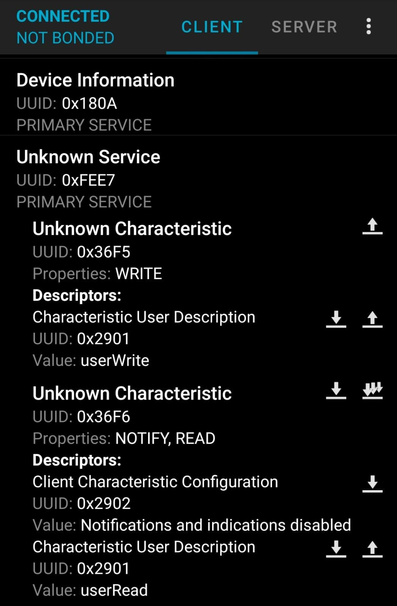

# MagicSwitchBot API

This document is based on the information sent by *Shenzhen Interear Intelligent Technology Co., Ltd*, manufacturer of the "MagicSwitchBot" device, which is aparently a clone of SwitchBot.

Some of the data present in this document is also based on my own research by sniffing the device protocol and decompiling the original App ([read here](MagicSwitchBot_Reverse_Engineer.md) for more details).

## 1. UUID's used by the device

The device uses BLE (Bluetooth Low Energy) to communicate with its own app which is available for Android and iOS.



It uses several UUID's for several purposes:

* **Service**
  This is the common service for all characteristics related to the custom protocol of command execution.
  * Long UUID: 0000fee7-0000-1000-8000-00805f9b34fb
  * Short UUID: 0xFEE7
* **Characteristics**:
  * **userWrite**
    This characteristic is used to send commands to the device.
    * Long UUID: 000036f5-0000-1000-8000-00805f9b34fb
    * Short UUID: 0x36F5
  * **userRead**
    This characteristic is used for the device to answer to the commands sent by the client.
    * Long UUID: 000036f6-0000-1000-8000-00805f9b34fb
    * Short UUID: 0x36F6
    * **Descriptors**:
      * **CLIENT_CHARACTERISTIC_CONFIG**
        This is a standard UUID that allows the parent characteristic of the device to send notifications to the client. When we write 0x0100 to it, it enables the notifications.
        * Long UUID: 00002902-0000-1000-8000-00805f9b34fb
        * Short UUID: 0x2902
* **OAD_SERVICE_UUID**
  This is used to update the device's firmware, following the OAD (Over the Air Download) profile of BLE.
  * UUID: f000ffc0-0451-4000-b000-000000000000
* **CC_SERVICE_UUID**
  Standard UUID for Connection Control.
  * UUID: f000ccc0-0451-4000-b000-000000000000

## 2. Broadcast Data

The device uses BLE advertisement to communicate its main parameters to the world. Aparently it sends advertisement packets every 3 seconds.

The `GAP Advertisement Data Type` used is **GAP_ADTYPE_MANUFACTURER**, and the advertisement payload is a packet of **12 bytes** with the following content:

| Item              | Content | Length | Description                                                  |
| ----------------- | ------- | ------ | ------------------------------------------------------------ |
| Identifier        | 0205    | 2      | The first and second bytes of the packet is always 0x02 0x05, which identifies the manufacturer of MagicSwitchBot and may be used to filter just this type of device. |
| Bluetooth Address | MAC     | 6      | The bluetooth MAC  address of this specific device.          |
| Power             | POWER   | 1      | Battery level (1 byte, values from 0 to 100).                |
| Password status   | EnPSW   | 1      | This field indicates if the user has set a password in the APP to access the device.<br />1 means that the user has set a password, and 0 mens he has not. |
| Reserved          | NC      | 2      | Reserved bytes. Not used.                                    |

## 3. Sending commands

You can have the device execute a command sending a payload of **16 bytes** through the `WriteData` UUID. This payload has the following structure:

| Pos            | Length         | Item  | Description                                                  |
| -------------- | -------------- | ----- | ------------------------------------------------------------ |
| 0              | 1              | CMD1  | Command identifier (first byte)                              |
| 1              | 1              | CMD2  | Command identifier (second byte)                             |
| 2              | 1              | LEN   | Length (number of bytes) of data                             |
| 3              | [DataLength]   | DATA  | Data or parameters for command execution                     |
| 3+[DataLength] | 4              | TOKEN | Unique Token for the current connection.<br />Provided by the device on connect. |
| 7+[DataLength] | 9-[DataLength] | RND   | Random data to fill the 16 byte payload.                     |

The DATA parameter has variable length, and is followed by a TOKEN and random data to fill the 16 bytes.

## 4. Commands reference

The following subsections describe the list of commands that the device can execute as asked by a client.

### 4.1. Check battery status

This command allows a client to check for the current battery level of the device.

#### Command

This command has the following structure:

| CMD1 | CMD2 | LEN  | DATA |
| ---- | ---- | ---- | ---- |
| 0x02 | 0x01 | 0x01 | 0x01 |

The command data has an only byte with value 0x01.

#### Response

If the device executes successfully the command, it returns the remaining battery percentage within this structure:

| Byte 00 | Byte 01 | Byte 02 | Byte 03       |
| ------- | ------- | ------- | ------------- |
| 0x02    | 0x02    | 0x01    | POWER (0-100) |

Otherwise, in case of error, it returns the following:

| Byte 00 | Byte 01 | Byte 02 | Byte 03 |
| ------- | ------- | ------- | ------- |
| 0x02    | 0x02    | 0x01    | 0xff    |

#### Notes

In case that the client does not send this command, the device itself will broadcast its battery status via BLE advertisement every 3 seconds.

### 4.2. Switching state

This command allows a client to make the device switch on or off.

### Request

| CMD1 | CMD2 | LEN  | DATA           |
| ---- | ---- | ---- | -------------- |
| 0x05 | 0x01 | 0x01 | [SwitchStatus] |

The parameter `SwitchStatus`can be one of the following values:

* 0x00: Switch Off.
* 0x01: Switch On
* 0x02: Toggle the current state.

### Response

If the device executes successfully the command, it returns:

| Byte 00 | Byte 01 | Byte 02 | Byte 03 |
| ------- | ------- | ------- | ------- |
| 0x05    | 0x02    | 0x01    | 0x00    |

Otherwise, in case of error, it returns the following:

| Byte 00 | Byte 01 | Byte 02 | Byte 03 |
| ------- | ------- | ------- | ------- |
| 0x05    | 0x02    | 0x01    | 0x01    |

### 4.3. Modify switch password

This command allows a client to change the device's password.

### Request

| CMD1 | CMD2 | LEN  | DATA                  |
| ---- | ---- | ---- | --------------------- |
| 0x05 | 0x04 | 0x07 | [Enpsw] [NewPassword] |

The parameter `EnPsw` has one byte length and can be one of the following values:

* 0x00: Disable password.
* 0x01: Enable password.

The parameter `NewPassword`has a length of 6 bytes and is the new password to set if the parameter `EnPsw`has value 0x01. The password must be numeric and always have 6 digits.

If `EnPsw`has value 0x00, `NewPassword`is ignored.

### Response

If the device executes successfully the command, it returns:

| Byte 00 | Byte 01 | Byte 02 | Byte 03 |
| ------- | ------- | ------- | ------- |
| 0x05    | 0x05    | 0x01    | 0x00    |

Otherwise, in case of error, it returns the following:

| Byte 00 | Byte 01 | Byte 02 | Byte 03 |
| ------- | ------- | ------- | ------- |
| 0x05    | 0x05    | 0x01    | 0x01    |

### 4.4. Timed switching

This command allows the client to *schedule* the change of the switching state of the device.

### Request

| CMD1 | CMD2 | LEN  | DATA                        |
| ---- | ---- | ---- | --------------------------- |
| 0x05 | 0x08 | 0x02 | [Time] [SwitchStatus] |

The parameter `Time`is a byte value (from 1 to 48) that specifies the amount of time (in multiples of 5 minutes) that the device will wait before executing the state switch. The maximum scheduled time is 240 minutes (4 hours).

The parameter `SwitchStatus`can be one of the following values:

* 0x00: Switch Off.
* 0x01: Switch On
* 0x02: Toggle the current state.

For example: If you want to switch on the device in half an hour, you specify `Time`with the value 0x06 and `SwitchStatus`with the value 0x01.

### Response

If the device executes successfully the command, it returns:

| Byte 00 | Byte 01 | Byte 02 | Byte 03 |
| ------- | ------- | ------- | ------- |
| 0x05    | 0x09    | 0x01    | 0x00    |

Otherwise, in case of error, it returns the following:

| Byte 00 | Byte 01 | Byte 02 | Byte 03 |
| ------- | ------- | ------- | ------- |
| 0x05    | 0x09    | 0x01    | 0x01    |

### 4.5. Token and password verification

This command allows the client to get the current token that we will use for subsequent commands. The client must execute this command always after a successful connection to the device, as the token is generated by the device after each connection and is different from previous one.

Every other command will require us to provide this token.

### Request

| CMD1 | CMD2 | LEN  | DATA       |
| ---- | ---- | ---- | ---------- |
| 0x06 | 0x01 | 0x06 | [Password] |

The parameter `Password` is the password that we have established to access the device. Initially when we pair the device to the APP, there is no password established.

The password is always numeric and uses **6 digits**. We must provide the **ASCII** codes of these digits as parameter.

For example: if our password is "123456", our command would be:

| CMD1 | CMD2 | LEN  | DATA           |
| ---- | ---- | ---- | -------------- |
| 0x06 | 0x01 | 0x06 | 0x313233343536 |

### Response

The command returns a structure in which provides us with the token and some other info:

| Byte 0 | Byte 1 | Byte 2 | Bytes 3 - 6 | Byte 7     | Bytes 8 - 9 | Byte 10   | Byte 11 |
| ------ | ------ | ------ | ----------- | ---------- | ----------- | --------- | ------- |
| 0x06   | 0x02   | 0x09   | [Token]     | [Chiptype] | [Ver]       | [DevType] | [EnPsw] |

The return structure has a data payload with 9 bytes and these are their values:

* <u>Token</u>: Returns the current token generated by the device on connect. Its length is 4 bytes.
* <u>ChipType</u>: Chip Platform type, as CC2541 01.
* <u>Ver</u>: Firmware version, with 2 bytes. First byte is the major version number and second is the minor version number.
* <u>DevType</u>: Device type. Currently, the MagicSwitchBot has DevType 0x07.
* <u>EnPsw</u>: Indicates if the device is using a password (0x01) or it is disabled (0x00).

Finally, in case of error (for example, if the specified password is incorrect) , the return structure is:

| Byte 00 | Byte 01 | Byte 02 | Byte 03 |
| ------- | ------- | ------- | ------- |
| 0x06    | 0x03    | 0x01    | 0x01    |

### 4.6 Firmware upgrade

This command starts an upgrade of the device's firmware Over the Air.

After the APP receives the basic response, the device will disconnect and restart after 200ms, and enter the firmware upgrade mode.

### Request

| CMD1 | CMD2 | LEN  | DATA |
| ---- | ---- | ---- | ---- |
| 0x03 | 0x01 | 0x01 | 0x01 |

### Response

If the device executes successfully the command, it returns this structure and starts the upgrade process:

| Byte 00 | Byte 01 | Byte 02 | Byte 03 |
| ------- | ------- | ------- | ------- |
| 0x03    | 0x02    | 0x01    | 0x00    |

Otherwise, in case of error, it returns the following:

| Byte 00 | Byte 01 | Byte 02 | Byte 03 |
| ------- | ------- | ------- | ------- |
| 0x03    | 0x02    | 0x01    | 0x01    |

## 5. Communications Encryption

All requests and responses from commands exchanged between the device and the client are encrypted using AES128 ECB algorithm.

This algorithm is a symmetric (reversible) encryption process that uses a key that is known by both parties before exchanging information. In MagicSwitchBot devices, the encryption key is a 16 bytes sequence whose decimal values are:


```python
[42, 97, 57, 92, 64, 85, 73, 81, 58, 90, 75, 98, 27, 109, 55, 53]
```

We must encrypt every command we send to the device with this key before sending it, and when a response comes out, we must decrypt it using the same key before we can interpret it.

The following is a Python example of how we can use the key to encrypt and decrypt data:

```python
from Crypto.Cipher import AES

KEY = [42, 97, 57, 92, 64, 85, 73, 81, 58, 90, 75, 98, 27, 109, 55, 53]


def encrypt (data):
  '''
  Encrypts data using AES128 ECB
  Parameters:
    data (list): List of numbers of the data to encrypt
  Returns:
    bytes: Encrypted data
  '''
  
  '''We need a byte string as the key to decrypt or encrypt'''
  key = bytes(bytearray(KEY))
  bdata = bytes(bytearray(data)) 
  cipher = AES.new(key, AES.MODE_ECB)
  
  return cipher.encrypt(bdata)


def decrypt (data):
  '''
  Decrypts data using AES128 ECB
  Parameters:
    data (bytes): Byte string of the data to decrypt
  Returns:
    bytes: Decrypted data
  '''
  
  '''We need a byte string as the key to decrypt or encrypt'''
  key = bytes(bytearray(KEY))
  decipher = AES.new(key, AES.MODE_ECB)
  return decipher.decrypt(data)


original_message = [1, 2, 3, 4, 5, 6, 7, 8, 9, 10, 11, 12, 13, 14, 15, 16]
print ("Original message: {}".format(bytes(bytearray(original_message))))
print ("Original hexadecimal: {}\n".format(bytes(bytearray(original_message)).hex()))

encrypted_message = encrypt(original_message)
print ("Encrypted message: {}".format(encrypted_message))
print ("Encrypted hexadecimal: {}\n".format(encrypted_message.hex()))

decrypted_message = decrypt(encrypted_message)
print ("Decrypted message: {}".format(decrypted_message))
print ("Decrypted hexadecimal: {}\n".format(decrypted_message.hex()))
```

When we run the previous code, this result is written to the console:

```text
Original message: b'\x01\x02\x03\x04\x05\x06\x07\x08\t\n\x0b\x0c\r\x0e\x0f\x10'
Original hexadecimal: 0102030405060708090a0b0c0d0e0f10

Encrypted message: b'i|\xbf\xf6X\xc1\xa9s\x89\x90\xc1\x96<\\\xfcT'
Encrypted hexadecimal: 697cbff658c1a9738990c1963c5cfc54

Decrypted message: b'\x01\x02\x03\x04\x05\x06\x07\x08\t\n\x0b\x0c\r\x0e\x0f\x10'
Decrypted hexadecimal: 0102030405060708090a0b0c0d0e0f10
```


## 6. Command execution process

The process to send and receive data from a MagicSwitchBot device follows the next logic:

1. **Connect to the device**.
   The client connects to the device using BLE.
   
1. **Get the token**.
   The client prepares a command to retrieve the current connection token:

   | CMD1 | CMD2 | LEN  | DATA                     |
   | ---- | ---- | ---- | ------------------------ |
   | 0x06 | 0x01 | 0x06 | [CurrentPassword] [Fill] |
   
   The `CurrentPassword` element is the password digits encoded as **6** ASCII characters. If there is no password, any data will be ignored, but there must be 6 bytes here.
   Finally, `Fill` is a sequence of **7** random bytes to fill the **16 bytes** payload.
   
1. **Encrypt the payload**.
   We encrypt the resulting command using AES128 ECB.

1. **Send the command**.
   We send the encrypted command using the `WriteData` UUID of the device.

1. **Receive the response**.
   Once the command is sent, we read the result using the `ReadData` UUID.
   For example we could get the following response:
   
   ```python
   [0x42,0xd1,0x46,0xc4,0xfe,0x0b,0x47,0x18,0x27,0xbd,0x6c,0x0d,0x6a,0xdb,0xc3,0x14]
   ```
   
1. **Decrypt the response data**.
   We use AES128 ECB to decrypt the received data. In the example, the decrypted message would be:
   
   ```python
   [0x06,0x02,0x04,0x01,0x02,0x03,0x04,0x58,0x96,0x67,0x42,0x92,0x01,0x33,0x31,0x41]
   ```

   So, the result tells us that the retrieval of the token is OK and the token value is `0x01,0x02,0x03,0x04`
   
1. **Prepare next command**.
   Once we have the token, we  can send other commands to the device. In this example we'll tell the device to **switch on**:

   ```python
   [0x05,0x01,0x01,0x01,0x54,0xa9,0x2b,0x78,0xd0,0xe5,0x33,0x31,0x05,0xa0,0x7e,0x54]
   ```

1. **Encrypt the payload**.
   AES128 ECB encryption of the command:
   
   ```python
   [0x7e,0x84,0x8f,0x92,0xd7,0x71,0xf2,0x3b,0x6e,0x86,0xfb,0x11,0x19,0x0c,0x55,0x5c]
   ```
   
1. **Send the command**.

1. **Receive the response**.
   The received *switch OK* response would be something like this:
   
   ```python
   [0x6a,0xd1,0xed,0xe7,0x9e,0xa1,0x31,0x27,0x84,0x48,0xad,0xac,0xb6,0xf2,0x90,0x9c]
   ```

1. **Decrypt the response data**.
   We decrypt the message using AES128 ECB and the result is:
   
   ```python
   [0x05,0x02,0x01,0x00,0x54,0xa9,0x2b,0x78,0xd0,0xe5,0x33,0x31,0x05,0xa0,0x7e,0x54]
   ```

   So, as a result, we know that the **switch on** command we sent did execute **successfully**.
